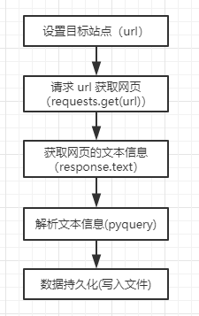

> 使用 requests 初次抓取网页。

requests 是基于内置库 urllib 编写的人性化、利于使用的 http 请求库。但是用 urllib 写爬虫过于繁琐且很少有人使用，
所以我就不再介绍了。requests 库的使用方法在官方文档已经讲述的十分清楚了，所以我在这里不会再复述，
但是一些常用的方法与参数，我会讲解一下需要注意的事项。

### requests 基本用法
关于 requests 的使用方法在[官方文档](https://github.com/requests/requests)中有介绍，
[快速上手](http://docs.python-requests.org/zh_CN/latest/user/quickstart.html)
教程也能带领我们快速入门。强烈建议先看以便快速上手后再来看本项目。在本章节中我就使用了`get`方法请求网页与，
请求之后就赋值给了 `response` ，然后再调用 `response` 的 `text` 方法获取
网页的文本信息。然后再用 `pyquery` 解析网页并读取详细信息。然后再讲数据写入文件。

1. 第一步设置目标站点，也就是你需要爬取的网页。
2. 发起 http 请求，请求网页信息。
3. 获取网页的文本信息，然后选取一种解析方式并解析文本。
4. 数据持久化，将数据存储起来。

第一个爬虫时获取一章内容。运行之后，打开目录下的`漫漫武仙路-第一章.txt`文件查看爬取的内容。
这个项目解析库使用的是pyquery（css selector，css选择器），需要先阅读[pyquery quickstart](https://pythonhosted.org/pyquery/#quickstart)
而写入文本，则使用的是普通的方法。

第二个爬虫是爬取整本书籍信息。获取一本小说只要一章章地下载就可以将全本数据给下载下来了。
所以第二个爬虫只要在第一个爬虫的基础上增加一个提取所有章节的 `url` 方法就可以将一本小说都给下载下来了。

第三个爬虫不能用`get`请求，因为猫眼设置了 User-Agent 过滤，只有设置了  User-Agent 才能正确请求到信息。
这个爬虫的解析有两种，一种是正则表达式（被我注释了），还有一种是xpath的解析方法。第三个爬虫通过 offset 构造了 url，
就与第一个爬虫中获取多个章节的 url 效果一样。